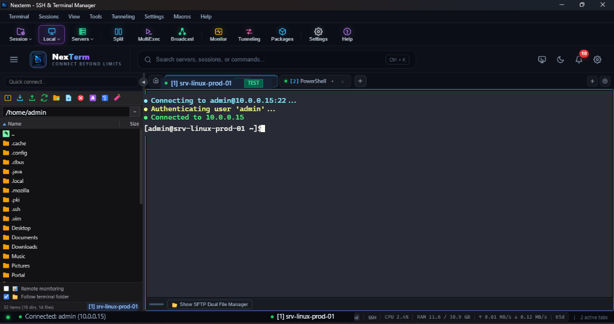
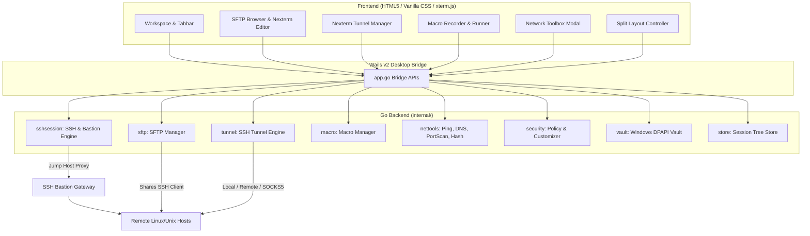

# NexTerm — Professional Desktop SSH & Systems Workspace

<div align="center">

[](https://golang.org)
[](https://wails.io)
[](https://xtermjs.org)
[](https://microsoft.com/windows)
[](https://apple.com/macos)
[](https://kernel.org)
[](#license)
[](https://github.com/kunal-live/NexTerm/releases/latest)
[](https://github.com/kunal-live/NexTerm/releases/download/v1.0.0/NexTerm-Windows-amd64.exe)

**NexTerm** is an all-in-one, cross-platform desktop SSH client, terminal emulator, SFTP browser, and remote infrastructure workstation built with **Go**, **Wails v2**, and **xterm.js**. Engineered for native execution on **Windows**, **macOS** (Apple Silicon & Intel), and **Linux**, it features zero artificial limits, enterprise-grade security controls, visual SSH tunnel management, bastion jump hosts, live server performance monitoring, multi-execution command broadcasting, macro automation, and multi-protocol connectivity.

**[👉 Click here to Download the Latest Release (Zero Setup Required)](https://github.com/kunal-live/NexTerm/releases/latest)**

</div>

---

<div align="center">



</div>

---

## 🌟 Key Features

```text
┌──────────────────────────────────────────────────────────────────────────────────────────────────────┐
│ Nexterm - SSH & Terminal Manager                                                           —  □  ✕   │
├──────────────────────────────────────────────────────────────────────────────────────────────────────┤
│ Terminal   Sessions   View   Tools   Tunneling   Settings   Macros   Help                            │
├──────────────────────────────────────────────────────────────────────────────────────────────────────┤
│ [Session ⌵] [Local ⌵] [Servers ⌵] [Split] [MultiExec] [Broadcast] [Monitor] [Tunneling] [Packages]...│
├──────────────────────────────────────────────────────────────────────────────────────────────────────┤
│ ☰  NexTerm  CONNECT BEYOND LIMITS  │ 🔍 Search servers, sessions... [Ctrl+K] │ 🖥️  🌙  🔔(10)  ⚙️    │
├────────────────────────────────────┼─────────────────────────────────────────────────────────────────┤
│ Quick connect...                   │ [🏠] [🟢 (1) AVI-IT-SRV-BRM-01 TEST] [🔵 (2) PowerShell] [+] ⚙ │
├────────────────────────────────────┼─────────────────────────────────────────────────────────────────┤
│ 📁 SFTP BROWSER (/home/pin)        │ • Connecting to pin@192.168.1.7:22...                           │
│ ├─ 📁 .cache                       │ • Authenticating user 'pin'...                                  │
│ ├─ 📁 .config                      │ • Connected to 192.168.1.7                                      │
│ ├─ 📁 .local                       │                                                                 │
│ ├─ 📁 .ssh                         │ [pin@AVI-IT-SRV-BRM-01 ~]$ █                                    │
│ └─ 📁 Documents                    │                                                                 │
├────────────────────────────────────┴─────────────────────────────────────────────────────────────────┤
│ 🟢 pin (192.168.1.7) • [1] AVI-IT-SRV-BRM-01 • SSH • CPU 2.4% • RAM 11.6/30.9 GB • 2 active tabs    │
└──────────────────────────────────────────────────────────────────────────────────────────────────────┘
```

### 📁 1. Graphical SFTP Browser & Embedded Editor (Nexterm Editor)
- **Shared Authentication**: Reuses the active SSH connection seamlessly without asking for passwords again.
- **Remote File Management**: Browse remote directory trees, create folders (`mkdir`), delete, rename, and download with native file save dialogs.
- **Drag-and-Drop Remote Upload**: Drop local files or directories directly onto the SFTP grid to upload in background.
- **Embedded Text Editor**: 1-click **Edit** opens remote configuration files, scripts, and logs in an in-app syntax editor with instant remote saving.

### ⇄ 2. Nexterm Tunnel Graphical Port Forwarding Manager
- **Local Port Forwarding**: Expose remote database ports (e.g., Oracle `1521`, MySQL `3306`, Postgres `5432`) locally on `127.0.0.1`.
- **Remote Port Forwarding**: Expose local test servers and services to remote SSH destinations.
- **Dynamic SOCKS5 Proxy**: Turn any remote SSH server into a secure local SOCKS5 proxy (e.g., `127.0.0.1:1080`).
- **Visual Status Management**: Real-time 🟢 Active / ⚪ Inactive status indicators, persistent configuration in `tunnels.json`, and 1-click start/stop.

### 🛡️ 3. SSH Gateway / Bastion Jump Host
- **Transparent Bastion Tunnels**: Connect to private hosts within isolated VPCs through intermediate Jump / Bastion hosts.
- **Two-Stage Multi-Stage Authentication**: Independent credential configuration for Bastion and Target hosts (Passwords, Vault Keys, or Private Key files).

### 🪟 4. Split Terminals (2-Way & 4-Way 2x2 Grid)
- **Flexible Layouts**:
  - `Single` full terminal view
  - `2-Way Vertical` (`Ctrl+Shift+\`)
  - `2-Way Horizontal` (`Ctrl+Shift+-`)
  - `4-Way 2x2 Grid`
- **Dynamic PTY Fit**: Automated column/row recalculation with `xterm-addon-fit` ensuring zero visual corruption or clipping.

### ⚡ 5. MultiExec Command Broadcasting
- Broadcast shell commands simultaneously across multiple remote servers in real time.
- **Scoped Targets**:
  - `All Connected Sessions`
  - `Selected Folder Hierarchy`
  - `Active Tab Only`

### 📜 6. Terminal Macro Automation Engine
- Record terminal keystrokes, save with custom names, and replay with 1-click on any single session or session group.
- **Pre-Seeded Playbooks**:
  - `System Diagnostics`: `uname -a; df -h; free -m; uptime; top -b -n 1 | head -n 20`
  - `Oracle BRM Status`: `cd $PIN_HOME; ./pin_ctl status; ps -ef | grep pin`
  - `BRM Restart`: `cd $PIN_HOME; ./pin_ctl stop; sleep 3; ./pin_ctl start`
  - `Network Ports Diagnostics`: `ss -tulpn; ip addr; netstat -rn`

### 🖥️ 7. Multi-Protocol Session Wizard
- **SSH**: Interactive PTY with Keep-Alive, Bastion Jump Host, and DPAPI password vault.
- **SFTP**: Standalone remote file explorer session.
- **RDP (Remote Desktop)**: Native Windows hardware-accelerated `mstsc.exe` integration with automated credential passing and multi-monitor settings.
- **Serial (COM)**: Automated COM port discovery (`COM1`–`COM8`) with configurable Baud Rates (9600 to 115200), Parity, Data Bits, and Stop Bits.
- **Local Shells**: Native PowerShell, Command Prompt (CMD), and WSL (Ubuntu/Debian) via ConPTY.

### 🛠️ 8. Integrated Network Toolbox
- **ICMP Ping**: Real-time ping latency test with packet loss statistics.
- **DNS Resolver**: Queries A, AAAA, and CNAME records for any domain or IP.
- **Concurrent Multi-Port Scanner**: Multi-threaded TCP port scanner testing common ports (21, 22, 80, 443, 1521, 3306, 5432, 8080) or custom port ranges.
- **Checksum & Hash Generator**: Computes SHA256, SHA1, and MD5 hashes.
- **SSH KeyGen**: Generates 2048/4096-bit RSA SSH key pairs in PEM and OpenSSH formats.

### 🔒 9. Enterprise Security Policies & NexTerm Customizer
- **Security Policy Enforcement**: Administrator toggles to allow or forbid specific protocols (SSH, SFTP, Telnet, FTP, RDP, VNC, Serial), enforce password complexity, or disable dangerous commands.
- **NexTerm Customizer**: Corporate white-label branding (Application Name, Logo Text, custom Startup/Splash messaging, and default company session catalogs).

### 🔑 10. Platform-Native Hardware-Bound Credential Vault
- Zero plain-text credentials on disk. All passwords, passphrases, and private keys are encrypted using native OS security APIs:
  - **Windows**: Windows DPAPI (`CryptProtectData`) tied to user profile.
  - **macOS**: Native macOS Keychain Services.
  - **Linux**: Freedesktop Secret Service API / system Keyring.

### 📈 11. Live Server Monitoring Dashboard
- **Real-Time Visual Sparklines**: Live canvas-rendered graphs for CPU utilization, RAM usage, and network RX/TX bandwidth (refreshed every 2.5s).
- **Out-of-Band SSH Probing**: Background diagnostic probes run on a dedicated SSH channel without interrupting or printing to your active interactive shell.
- **Process & Port Management**: Inspect listening ports, associated daemons, and PIDs. Terminate runaway processes with a single click.
- **Interactive User Management**: View active TTY logins and disconnect idle or unauthorized user sessions directly from the dashboard.
- **Storage Metrics**: Visual disk usage bars across all mounted remote filesystems.

### 🖥️ 12. X11 Forwarding & Local X Server Manager
- **Remote GUI App Display**: Seamless SSH X11 tunneling (`x11-req`) forwarding remote Linux graphical applications (e.g. `xclock`, `gedit`, `firefox`, database installers) directly to your Windows desktop.
- **Local X Server Detection & Launch**: Automatically detects and launches local Windows X servers (VcXsrv, Xming, GWSL) on display `:0` (port `6000`).

### 💾 13. Portable Session Tree Backup, Export & Import
- **Native File Dialogs**: Export your entire hierarchical session tree (folders, host configurations, environments, and jump host bindings) into a portable JSON backup file.
- **1-Click Import & Merge**: Restore or transfer session catalogs from another machine seamlessly with native file picker integration.

### 🎛️ 14. Adaptive Multi-Pane Workspace & Resizable Sidebar
- **Resizable Sidebar**: Drag the custom splitter bar to adjust the navigation and session panel width, with persistent state saved across sessions.
- **Intelligent Header Layering**: Eliminates redundant global tab bars when multiple split panes are open, providing a clean, single-layer header per pane.
- **Collapsible SFTP Dual Manager**: Easily toggle or drag the SFTP panel to expand terminal real estate when focusing on command execution.

### ⚡ 15. Modern Quick-Access Action Toolbar & Theme Engine
- **One-Click Actions**: Instant access to `Session ⌵`, `Local ⌵`, `Servers ⌵`, `Split`, `MultiExec`, `Broadcast`, `Monitor`, `Tunneling`, `Packages`, `Settings`, and `Help` with custom vibrant neon vector line-art.
- **Interactive State Feedback**: Active state indicators with neon purple glow (`border: 1px solid rgba(168, 85, 247, 0.6)`), live tab counts, and smooth dropdown animations.
- **Adaptive Theme Switcher**: 1-click toggle between sleek dark glassmorphism (Dark Modern) and bright readable desktop styling (Light Modern).

---

## 🏗️ Architecture



---

## 🚀 Getting Started

### 🌐 Multi-Platform Support
NexTerm is designed and tested for native execution across:
- **Windows**: Windows 10 & Windows 11 (`x86_64`, `ARM64`)
- **macOS**: macOS 11+ Big Sur through Sequoia (Native Apple Silicon `arm64` M1/M2/M3/M4 & Intel `x86_64`)
- **Linux**: Ubuntu, Debian, Fedora, Arch Linux, RHEL, openSUSE (`x86_64`, `arm64`)

### Prerequisites
- **Go 1.22+** ([golang.org](https://golang.org/dl/))
- **Wails CLI v2.9+** ([wails.io](https://wails.io/docs/gettingstarted/installation))
  ```bash
  go install github.com/wailsapp/wails/v2/cmd/wails@latest
  ```
- **Node.js 18+** (Optional, for frontend asset modification)
- **Linux Dependencies** (Linux only):
  ```bash
  # Ubuntu / Debian
  sudo apt-get update && sudo apt-get install -y libgtk-3-dev libwebkit2gtk-4.0-dev

  # Fedora / RHEL
  sudo dnf install -y gtk3-devel webkit2gtk3-devel

  # Arch Linux
  sudo pacman -S gtk3 webkit2gtk
  ```

### Quick Launch (Windows)
Double-click `run.bat` or execute in PowerShell:
```cmd
run.bat
```

### Build from Source
Compile optimized release binaries for your operating system:

**Windows:**
```powershell
wails build -platform windows/amd64 -clean
# Output: build\bin\nexterm.exe
```

**macOS (Apple Silicon & Intel):**
```bash
wails build -platform darwin/arm64 -clean   # Apple Silicon (M1/M2/M3/M4)
wails build -platform darwin/amd64 -clean   # Intel Mac
# Output: build/bin/Nexterm.app
```

**Linux:**
```bash
wails build -platform linux/amd64 -clean
# Output: build/bin/nexterm
```

---

## ⌨️ Keyboard Shortcuts

| Shortcut | Action |
| :--- | :--- |
| `Ctrl + K` | Open Universal Command Palette |
| `Ctrl + N` | New SSH Session Dialog |
| `Ctrl + T` | Open Local PowerShell Tab |
| `Ctrl + W` | Close Active Tab |
| `Ctrl + Shift + F` | Terminal In-Buffer Text Search |
| `Ctrl + Shift + \` | 2-Way Vertical Split |
| `Ctrl + Shift + -` | 2-Way Horizontal Split |
| `Alt + M` | Toggle MultiExec Command Broadcast |
| `Ctrl + Tab` | Next Tab |
| `Ctrl + Shift + Tab` | Previous Tab |
| `Ctrl + Shift + C` | Copy Selected Terminal Text |
| `Ctrl + Shift + V` / `Right Click` | Paste into Terminal |

---

## 📄 License

This project is licensed under the MIT License — see the [LICENSE](LICENSE) file for details.
